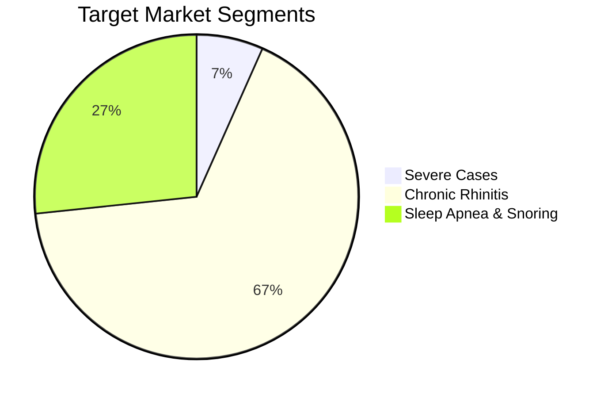
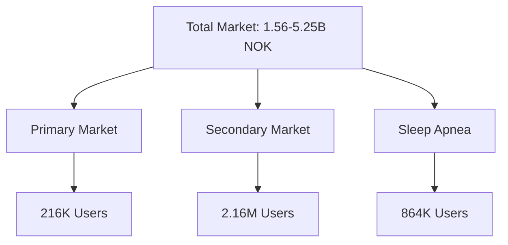
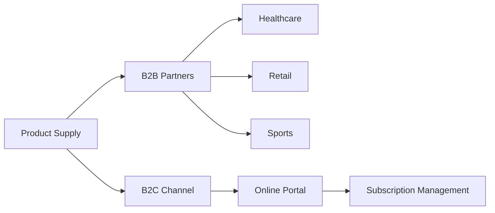
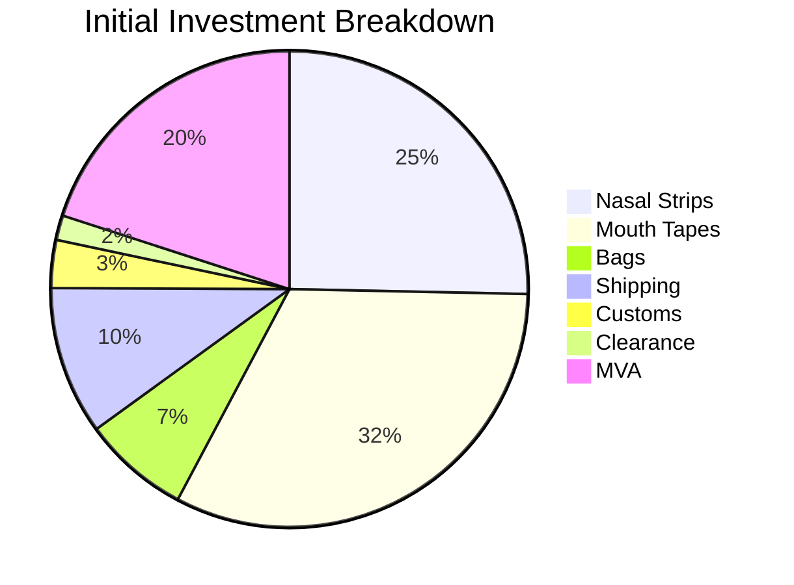
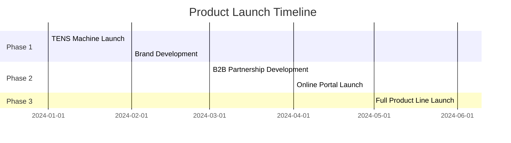

# Health Products Business Plan - Norway Market

## Executive Summary
We are developing a health products business focusing on sleep and restoration solutions for the Norwegian market, targeting both B2B and B2C channels. Our initial product line includes nasal strips and mouth tapes, with a planned TENS machine launch.

## Market Opportunity

### Total Addressable Market (TAM)
- **Primary Market (Severe Cases)**: 354-1,102M NOK/year
- **Secondary Market (Chronic Rhinitis)**: 583-2,074M NOK/year
- **Sleep Apnea Market**: 622-2,074M NOK/year
- **Total Combined TAM**: 1.56-5.25B NOK/year

## Business Model
### Distribution Channels
1. **B2B Partners**:
   - Healthcare Providers
     - Physical Therapists
     - Chiropractors
     - Dentists
     - Osteopaths
     - Orthodontic clinics
   - Retail
     - Health food stores
     - Pharmacies
     - Gyms
   - Sports Teams
     - Lillehammer hockey team partnership
2. **B2C Channel**:
   - Online subscription portal
   - Target demographic: Ages 20-40
   - Focus on sleep and restoration needs

## Product Strategy
### Initial Product Line
| Product | MOQ | Price/Unit | Total Cost |
|---------|-----|------------|------------|
| Nasal Strip S1 | 100 | $6.99 | $699 |
| Mouth Tape | 500 | $1.79 | $895 |
| Custom Packaging | 500 | $1.60 | $800 |

### Innovation Features
- QR codes on packaging for easy refill orders
- Display units for brand visibility
- Digital portal for subscription management

### Cost Structure (NOK)

#### Detailed Costs
- **Base Costs**: 19,376kr
  - Nasal Strips (100): 7,550kr
  - Mouth Tapes (500): 9,666kr
  - Bags (100): 2,160kr
  
- **Additional Costs**: 4,469kr
  - Shipping: 3,000kr
  - Customs (5%): 969kr
  - Clearance: 500kr
- **Final Total**: 29,806kr (including 25% MVA)

## Implementation Timeline

## Investment Requirements
### Initial Investment Needs
- Product inventory: 29,806kr
- TENS machine: $250
- Marketing and display units
- Digital platform development

### Strategic Partnership Opportunities
- Healthcare providers
- Sports teams (Lillehammer hockey)
- Retail chains

## Risk Mitigation
1. Starting with unbranded TENS machine to minimize inventory risk
2. Phased product launch approach
3. Multiple distribution channels
4. Flexible pricing strategy

## Next Steps
1. Secure initial funding
2. Finalize supplier agreements
3. Develop digital platform
4. Establish key B2B partnerships
5. Launch marketing campaign
