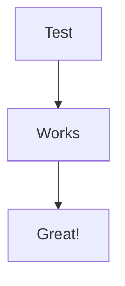
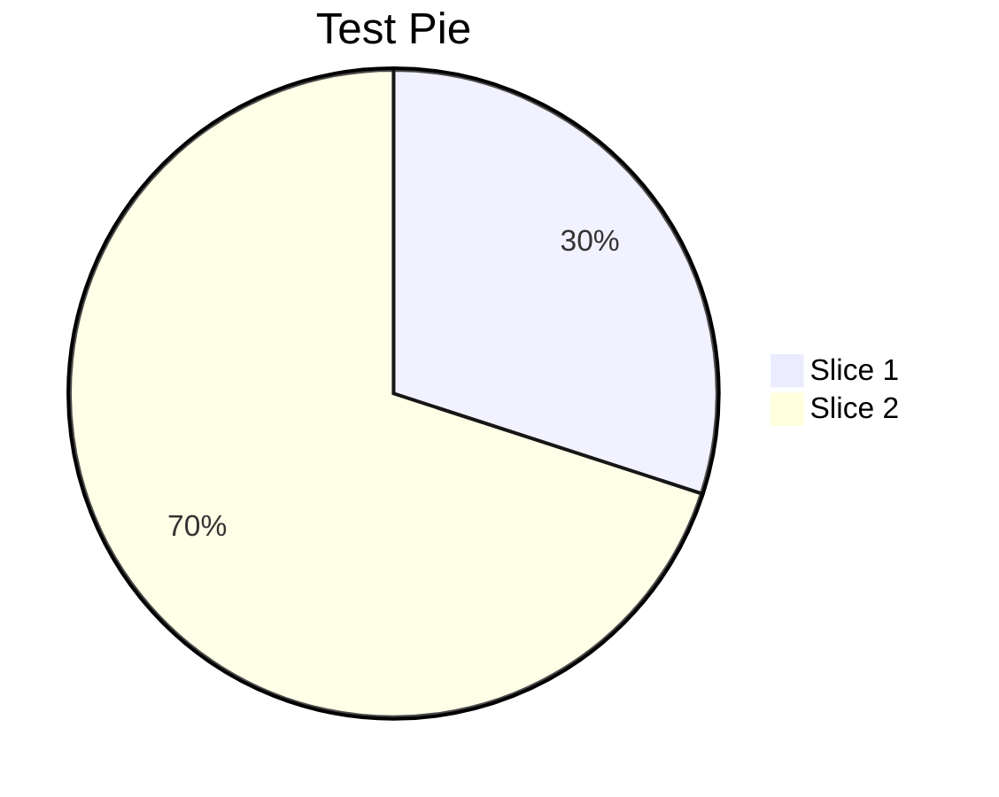
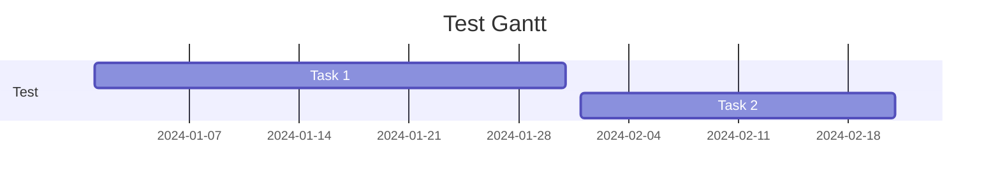

# Test Mermaid

```mermaid
graph TD
    A[Test] --> B[Works]
    B --> C[Great!]
```

```mermaid
pie title Test Pie
    "Slice 1" : 30
    "Slice 2" : 70
```

```mermaid
gantt
    title Test Gantt
    dateFormat  YYYY-MM-DD
    section Test
    Task 1 :2024-01-01, 30d
    Task 2 :2024-02-01, 20d
```
